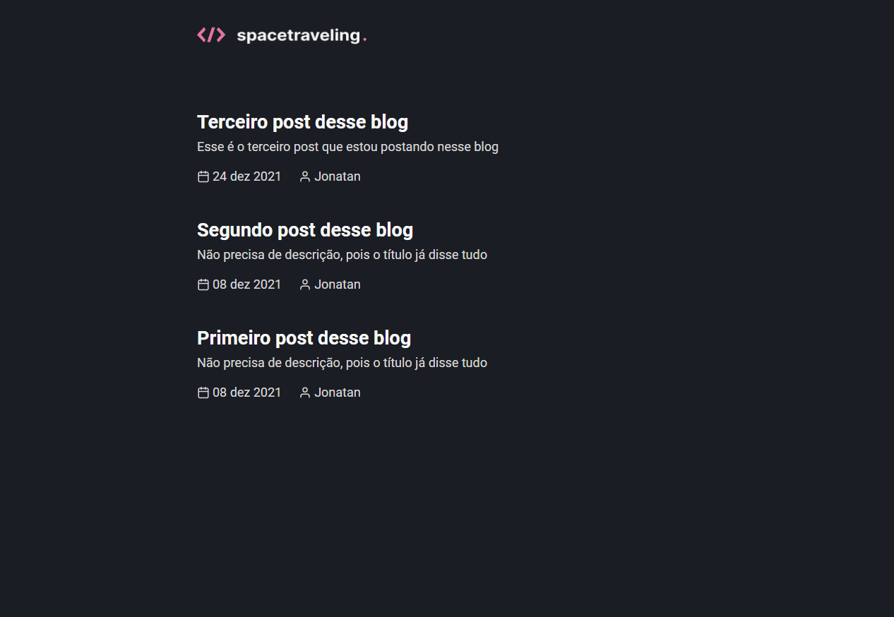

<h1 align="center">
  Spacetraveling
</h1>

Este desafio consiste em criar um blog do zero

## 👀 Requisitos Principais
- [x] Listar todas as publicações
- [x] Visualizar uma publicação

## 🔧 Ferramentas Utilizadas
- NextJS
- Prismic CMS
- React Icons
- date-fns

## 💻 Aplicação

## 🌠 Extras
Para mais detalhes sobre o desafio, acesse [esse link](https://www.notion.so/Desafio-01-Criando-um-projeto-do-zero-b1a3645d286b4eec93f5f1f5476d0ff7)
